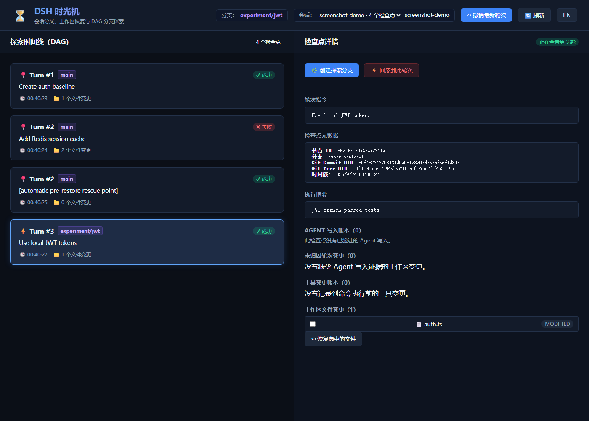

# DSH Time Machine（时光机）

**让 DSH 的会话与工作区一起回到检查点，并从旧节点继续探索。**

面向 DeepSeek Harness 的非官方社区插件：保存文件和会话边界，预览后恢复工作区，并保留每条尝试过的分支。

[English](README.en.md) · [功能对照](docs/COMPARISON.md) · [测试记录](docs/TEST_PLAN.md) · [问题反馈](https://github.com/GeoSyntax/dsh-plugin-time-machine/issues)

## 效果预览



这是实际运行的 Web 界面截图，**其中的认证、Redis 和 JWT 内容是为演示创建的样例数据**。它展示了失败节点仍在时间线中、恢复前的救援检查点，以及从旧节点继续的 `experiment/jwt` 分支。界面默认中文，可切换英文。

## 安装

先安装 [DeepSeek Harness](https://github.com/deepseek-ai/deepseek-harness) 和 pnpm；需要 Node.js `^22.19.0 || >=24.0.0`。当前支持 DSH `>=0.1.5-rc.2 <0.2.0` 的 `web` profile。

```bash
dsh plugin --profile web add github:GeoSyntax/dsh-plugin-time-machine
```

插件的 `cordis.patch.yml` 会作为 Bundle 随安装加入 profile。安装或更新后重启 DSH；无需再手动复制插件配置。当前通过 GitHub 安装，尚未发布 npm 包。[DSH 的 Bundle 安装说明](https://github.com/deepseek-ai/deepseek-harness/blob/master/docs/user/develop/basic/publish.md)解释了 profile 的加载方式。

## 快速开始

在希望 Agent 修改的项目目录启动：

```bash
dsh web
```

打开 DSH Web，完成一轮会修改文件的对话。插件默认在轮次边界创建检查点。随后在会话里输入：

```text
/tm-list
/tm-tree
```

`/tm-list` 显示检查点 ID，`/tm-tree` 显示分支关系。另一个页面打开 `http://127.0.0.1:3088`，即可查看中文仪表盘、文件变化和恢复预览。选择一个检查点，先预览影响，再决定恢复或从该节点创建分支。DSH Web 自身默认运行在 `http://127.0.0.1:3080`；两者是不同页面。

## 能做什么

- **恢复工作区：** 预览目标文件、冲突及外部副作用，确认后回到旧检查点；普通新增文件会随完整恢复清理，忽略文件默认保留。
- **保留探索路径：** 检查点组成持久化 DAG；从旧节点 fork 时保留原来的失败分支和错误证据。
- **对齐会话：** 回滚时请求 DSH 从对应消息边界创建会话分支，同时恢复文件；原会话历史继续保留。
- **记录失败线索：** 将失败工具的摘要用于新分支的反思提示，帮助 Agent 避开已知错误。
- **适配非 Git 目录：** 没有 Git 仓库时使用 manifest 和内容哈希保存快照。

完整操作与同类插件的逐项比较见[功能对照](docs/COMPARISON.md)。

## 使用边界

- 默认 `safe` 模式遇到无法验证的用户修改、暂存区变化或受保护的忽略文件时会拒绝覆盖；恢复前请查看 preview。
- 当前 DSH 宿主的 fork 共用工作区，不提供独立 worktree 或容器。并行会话修改同一目录时，应先确认工作区状态。
- 文件回滚不能撤销数据库事务、网络请求或云资源变更；插件能记录并提示这类副作用，严格门禁与补偿适配器需要按项目配置。
- 完整恢复和选择性文件恢复是不同操作；需要只恢复某些文件时，应使用选择性恢复功能。

更深入的安全策略、可选加密和配置项见 [设计文档](DESIGN.md)。

## 验证

仓库的 [CI](https://github.com/GeoSyntax/dsh-plugin-time-machine/actions/workflows/ci.yml) 覆盖 Node.js 22/24 的 Windows、macOS、Ubuntu，DSH Bundle 加载、客户端 companion、依赖审计及自动化测试。[测试计划](docs/TEST_PLAN.md)还记录了本地 DSH 源码宿主与 Web 流程的验证方法。截图展示的是界面和样例时间线；它本身不构成外部副作用可回滚的证明。

## 许可证

MIT
