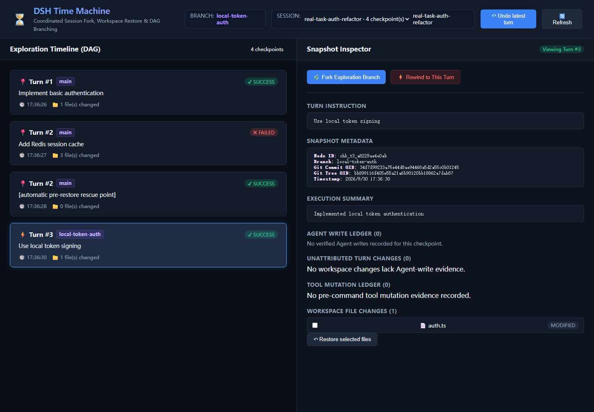

# 真实任务演示报告

本报告记录一次由维护者亲自运行的可丢弃示例任务，而不是只运行单元测试或静态配置检查。

## 任务场景

目标是为一个小型认证模块选择实现方案：

1. 先创建 `auth.ts` 基线，实现最基本的用户认证；
2. 尝试引入 Redis 会话缓存；
3. Redis 方案失败，并产生 `redis.ts` 与 `debug-output/failed.log` 等新增工作区文件；
4. 从基线 checkpoint 分叉到 `local-token-auth`；
5. 使用本地 token 实现替代 Redis；
6. 通过 Dashboard 检查 DAG、失败证据、恢复点和文件 Diff。

## 实际运行结果

运行命令：

```powershell
pnpm exec tsx test/live-demo.ts
```

本次独立 Web 演示使用了临时 Git workspace 和真实 `TimeMachineService`、`TimeMachineWebServer` 实例，运行结果为：

```text
sessionId: real-task-auth-refactor
baseline: chk_t1_5e7f34402518
fixed: chk_t3_a8229ae4e0ab
url: http://127.0.0.1:3188
nodeCount: 4
branchCount: 2
diffCount: 1
DEMO_SERVER_READY
```

工作区变化和回滚结果：

- `auth.ts` 从基线实现变为失败的 Redis 版本；
- `redis.ts` 和 `debug-output/failed.log` 属于失败尝试；
- 从基线创建 `local-token-auth` 分支后，失败尝试的新增文件被清理；
- 新分支写入本地 token 认证实现；
- DAG 持久化了 4 个节点：基线、失败尝试、自动恢复前救援点、分叉后的成功实现；
- `/api/diff` 返回 1 个文件差异；
- Dashboard 右侧可查看 checkpoint 元数据、Git commit/tree OID、工作区文件变化和恢复入口。

## 实际截图



截图来自上述运行生成的 `http://127.0.0.1:3188/?sessionId=real-task-auth-refactor`，不是设计稿或合成图片。截图中的认证实现、Redis 失败和 local-token 分支均为本次可丢弃演示任务生成的样例数据，不包含真实业务代码、密钥或外部服务凭据。

## 证据边界

这次演示证明插件服务层确实完成了工作区快照、失败分支保留、物理清理、分叉、DAG 和 Web 展示；它不等同于真实模型一定会选择 DSH 原生工具，也不证明数据库、网络请求或其他外部副作用可以被文件恢复撤销。真实 DSH 宿主边界见 [HOST_VALIDATION_REPORT.md](HOST_VALIDATION_REPORT.md)。
